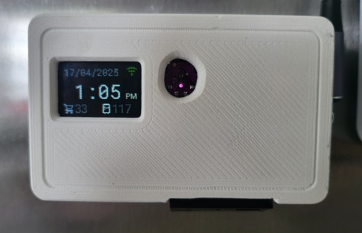
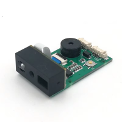
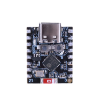
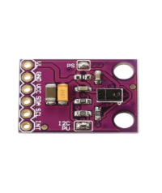
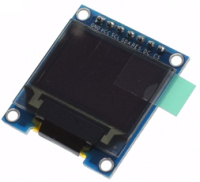
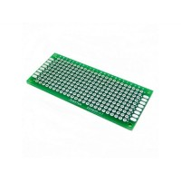
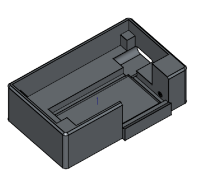
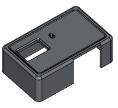
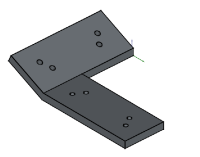
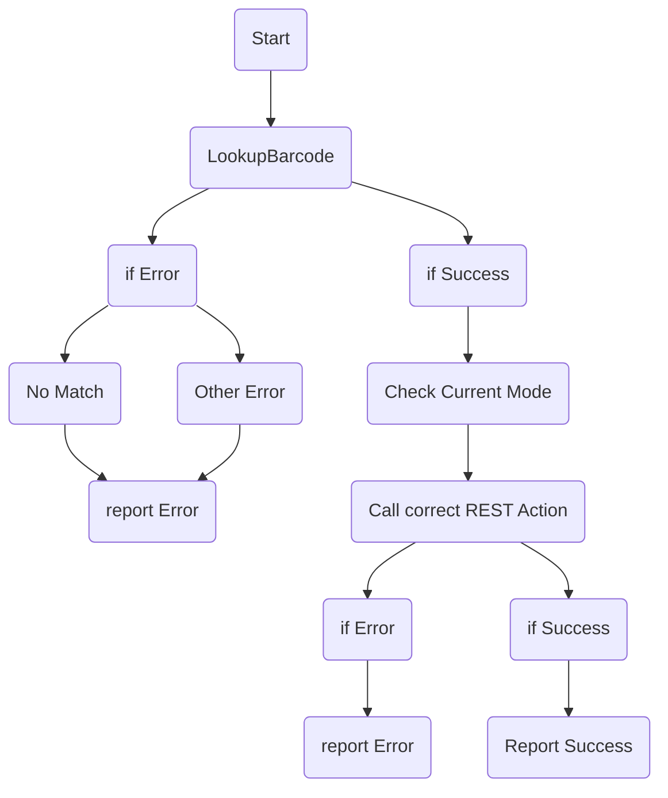

# ESPHome Grocy Barcode Scanner



This is the latest effort in my attempts to actually make use of Grocy in my house. Grocy is a very cool looking way to keep track of your groceries, however it is very powerful. With great power, comes great complexity, and this great complexity generally leads to adoption difficulties.

We have found that when bringing the shopping home it really is just too much effort to consistently get a phone, find the app, open the app and get the right scanner mode running. The hope is by introducing a dedicated barcode scanner that can easily accessed, that obstacle would be removed.

Also, I just wanted to make a cool barcode scanner.

Special thanks goes to [MattFryer's HA-mealie-Barcode-Scanner](https://github.com/MattFryer/HA-Mealie-Barcode-Scanner), most of the code for interacting with the GM67 barcode scanner came from their work. Their readme contains a lot of useful information. In particular, the notes about setting it into UART mode, and how the wires are non standard colors.

> [!WARNING]
> You may think you can subsitute another barcode scanner instaed of the GM67. While you may have success with this, DO NOT GET A GM60 (round with a rgb ring). It sucked. GM67 is way better and worked perfectly in this project. 

## Features
- Can scan any barcode supported by the [GM67 scanner](http://www.growbarcode.com/productinfo/888736.html)
- On a scan, can:
  - Add item to stock
  - Remove item from stock
  - Open item in stock
  - Look up item stock
  - Add item to shopping list (WIP)
- Navigate menu with gestures (swipes) in front of unit
- Display simple information on screen
  - Current Mode
  - Product Scanned
  - Product Stock
- Info screen
  - Can be toggled (such as when user in room) to prevent screen burn in
  - Shows
    - Time
    - Date
    - Current Stock Count
    - Current Shopping list count
- When paired with a TTS enabled voice asssitant in Home Assistant (Such as the [Home Assistant Voice PE](https://www.home-assistant.io/voice-pe/))
  - Speak current action
  - Speak current stock levels 


## Assumptions
- You have a [Home Asisstant](https://www.home-assistant.io/) instance
- You have the [Grocy Custom Integration](https://github.com/custom-components/grocy) added.
  - The Grocy integration requires HACS, however it is only actually used to provide the numbers for the info page on the scanner's screen. All the other actions are actually done through REST commands. Thus, this step is actually quite optional.
- You have a [Grocy](https://grocy.info/) instance 
- You have [ESPHome](https://esphome.io/) setup and ready to go
- Your Home Assistant can reach your Grocy install

## Bill of Materials
Prices are approximate

| Image                       | Item                      | Cost (AUD) |
| --------------------------- | ------------------------- | ---------- |
|  | GM67 UART Barcode Scanner | \$30       |
| |                              ESP32-C3 Mini         | $5
|        |  GY-9960-3.3 APDS-9960 RGB Infrared Gesture Sensor |$5 |
| | SSD1331 0.95 inch Color OLED | $10|
| | 3x7cm Prototype Board |$2 |
| | USB C-type 2 pin connector socket with buckle | $0.40 |
| | Printed Case Body | $0.65|
| | Printed Case Lid | $0.55 |
| | Printed Angle Adapter | $0.05 |
| | One M3 screw, no longer than 16mm| |
| | Wires | |
| | Magnets, if attaching to Fridge | |

## Software

### ESPHome
Create a new device in ESPHome, and use the code in `barcode-scanner.yaml`. In particular, pay attention to the substitutions section at the top, and update as needed. If you use a different ESP board, you may want to use different pins.

Also change the HA Sensors section as you see fit. If you don't use the grocy interation here, you shouldn't need it at all. 

```yaml
substitutions:
  # Names
  device_id: kitchen-barcode-scanner
  device_name: Kitchen Barcode Scanner

  # UART Pins for the Barcode Scanner
  uart_tx_pin: GPIO21
  uart_rx_pin: GPIO20

  # i2C for Gesture Sensor
  i2c_sda_pin: GPIO08
  i2c_scl_pin: GPIO09

  # SPI and Display Pins
  spi_clk_pin: GPIO4
  spi_mosi_pin: GPIO6

  diplay_cs_pin: GPIO0
  display_dc_pin: GPIO1
  diplay_reset_pin: GPIO2

  # HA Sensors for info screen
  ha_sensor_1: sensor.grocy_shopping_list
  sensor_icon_1: mdi:cart-outline
  sensor_1_color: "838996"

  ha_sensor_2: sensor.grocy_stock
  sensor_icon_2: mdi:fridge-outline
  sensor_2_color: "ffffff"

  # Timezone
  timezone: Australia/Sydney
  ```

**Why set a timezone?**
The display shows a clock, and I have this issue I haven't bothered figuring out that makes my ESPHome devices show the wrong time unless I explicitly set the timezone on them. If you don't have this issue, you could just remove the timezone setting from here

```yaml
time:
  - platform: homeassistant
    id: homeassistant_time
    timezone: ${timezone} # <-- Remove this
```

### Home Assistant

#### config

Add the `rest_commands` found in the `Home Assistant Grocy Scripts.yml` file to your Home Assistant config file (currently there is no UI for this :(). Replace `[GROCY_URL]` and `[GROCY_API_KEY]`.

**Why not use the Grocy Integration here?**
If there was an error response (such as trying to open a product when stock was 0), the error would just stop the automation. Using a rest api call also shows the exact error message we get, which allows us to work with it.

#### Automations
Use the code in `Home Assistant Grocy Barcode Scan Automation.yml` to build an automation. Check enitity names are correct.

The rough flow of the automation is this:



(**Note**: this graph isn't accounting for a couple extra branches of what exactly is going on for each different action. You can see that in the traces after adding the automation)

**Note**: I also suggest setting up an automation to toggle the info screen so that it is only shown when someone might be looking at it, otherwise I imagine burn in may be an issue.

## Known Issues
- The GM67 will always turn on the scanner when powered. Currently, the ESP device sends a command to turn it off as part of it's boot process. Perhaps this could happen faster?
- The hole for the gesture sensor in the printed lid is far too small. I solved this by using a drill until it started working. The model should be corrected to find the correct hole size and placement.
